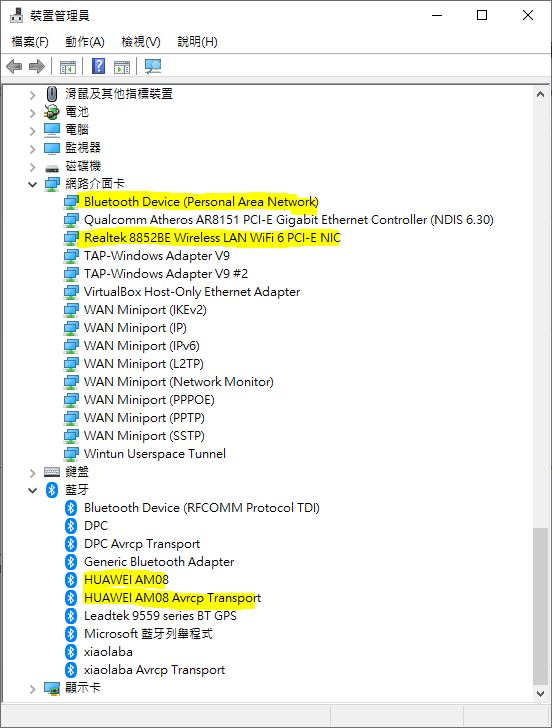

# 8852BE_win_driver
Lenovo provided driver for 8852BE WIFI6 card  

bat file for installation
it is win11 driver, however works for win10 at some cases.  

### Lenovo
original download link, https://pcsupport.lenovo.com/us/en/products/laptops-and-netbooks/5-series/ideapad-pro-5-16irh8/downloads/driver-list/component?name=Networking%3A%20Wireless%20LAN&id=E3519D23-890E-4DE1-9064-DE6E7DA2515B

64 bits, 2023-MAR-06
WLAN, Intel_22.190.0.4_Realtek_8852BE_6001.15.123.302_8852CE_6001.16.124.300
BT, Intel_BT_22.190.0.2_Realtek_8852BE_1.9.1051.3009_8852CE_1.9.1051.3009

### dell
Realtek RTL8852BE Wi-Fi 和藍牙驅動程式  
https://www.dell.com/support/home/zh-tw/drivers/driversdetails?driverid=ryyj8  


### microsoft catalog, Realtek Semiconductor Corp. - Net - 6001.15.143.0   
https://www.catalog.update.microsoft.com/Search.aspx?q=Realtek+8852BE+   
Realtek Semiconductor Corp. - Net - 6001.15.143.0 	Windows 10, Vibranium and later, Servicing Drivers 	Drivers (Networking) 	2023/6/5   


```
;;----------------------------------------------------------------------------
;; For 8852B RTK common
;;----------------------------------------------------------------------------

;;Realtek demoboard
%RTL8852be.DeviceDesc% = RTL8852be.ndi, PCI\VEN_10EC&DEV_B852&SUBSYS_B85210EC
;; temp key with wrong ID to prevent persistent BSOD in the beginning PCI\VEN_10EC&DEV_B852&SUBSYS_B85210EC
```

```
copy *.exe to c:\8852BE_driver\
::installation
cab, manually installation is requried

```

testing done,  
  
